# GitHub Merge Queue Setup

This document describes the GitHub-based approval and merge system that replaces Prow Tide.

## Overview

The repository now uses GitHub workflows and merge queue instead of Prow Tide for managing PR approvals and merges. This provides:

- Label-based approval system via comment commands
- Required status checks for merge readiness
- Automatic merging via GitHub merge queue

## Workflow Diagram

```mermaid
flowchart TD
    Start([PR Created/Updated]) --> AutoChecks{Automatic Checks}
    
    AutoChecks --> WIP[Check WIP Status]
    AutoChecks --> ReleaseNote[Check Release Note Label]
    AutoChecks --> Rebase[Check Merge Conflicts]
    
    WIP -->|WIP detected| WIPLabel[Add: do-not-merge/work-in-progress]
    WIP -->|Ready| WIPRemove[Remove: do-not-merge/work-in-progress]
    
    ReleaseNote -->|Missing label| RNLabel[Add: do-not-merge/release-note-label-needed]
    ReleaseNote -->|Has label| RNRemove[Remove: do-not-merge/release-note-label-needed]
    
    Rebase -->|Conflicts| RebaseLabel[Add: needs-rebase]
    Rebase -->|Clean| RebaseRemove[Remove: needs-rebase]
    
    WIPLabel --> ManualReview
    WIPRemove --> ManualReview
    RNLabel --> ManualReview
    RNRemove --> ManualReview
    RebaseLabel --> ManualReview
    RebaseRemove --> ManualReview
    
    ManualReview{Manual Review} -->|Reviewer comments /lgtm| LGTMLabel[Add: lgtm]
    ManualReview -->|Maintainer comments /approve| ApprovedLabel[Add: approved]
    ManualReview -->|Anyone comments /hold| HoldLabel[Add: do-not-merge/hold]
    
    LGTMLabel --> MergeCheck
    ApprovedLabel --> MergeCheck
    HoldLabel --> MergeCheck
    
    MergeCheck{Merge Readiness Check}
    
    MergeCheck -->|Has lgtm + approved<br/>No blocking labels| Ready[✅ Status: PASS]
    MergeCheck -->|Missing lgtm or approved| NotReady[❌ Status: FAIL<br/>Missing required labels]
    MergeCheck -->|Has blocking labels| Blocked[❌ Status: FAIL<br/>Has blocking labels]
    
    Ready --> MergeQueue[Add to Merge Queue]
    NotReady --> Wait[Wait for approvals]
    Blocked --> Wait
    
    Wait --> ManualReview
    
    MergeQueue --> FinalChecks{All CI Checks Pass?}
    FinalChecks -->|Yes| Merge([🎉 PR Merged])
    FinalChecks -->|No| Failed([❌ Merge Failed])
    
    style Start fill:#e1f5ff
    style Merge fill:#d4edda
    style Failed fill:#f8d7da
    style Ready fill:#d4edda
    style NotReady fill:#fff3cd
    style Blocked fill:#f8d7da
    style MergeQueue fill:#cfe2ff
```



### Key Points
- **Green boxes** = Success states
- **Yellow boxes** = Waiting/pending states  
- **Red boxes** = Blocked/failed states
- **Blue boxes** = Active processing

## Approval System

### Commands

Maintainers with **write** access can use the following commands in PR comments:

#### `/lgtm` - Looks Good To Me
Adds the `lgtm` label to indicate code review approval.

```
/lgtm
```

To remove the label:
```
/lgtm cancel
```

**Restrictions**: 
- Requires write access to the repository
- ⚠️ PR authors and co-authors cannot `/lgtm` or `/approve` their own PRs

#### `/approve` - Final Approval
Adds the `approved` label to indicate final approval for merge.

```
/approve
```

To remove the label:
```
/approve cancel
```

**Restrictions**: 
- Requires write access to the repository  
- ⚠️ PR authors and co-authors cannot `/lgtm` or `/approve` their own PRs

#### `/hold` - Hold PR from Merging
Adds the `do-not-merge/hold` label to block a PR from merging. Both maintainers and PR authors can use this command.

```
/hold
```

To remove the hold:
```
/unhold
```
or
```
/hold cancel
```

### Permissions

- Only users with **write** access to the repository can use approval commands
- Commands must be placed at the start of a comment
- The bot will react with emoji to indicate status:
  - 👀 (eyes) - Processing command
  - 👍 (+1) - Label added successfully
  - 👎 (-1) - Label removed successfully
  - 😕 (confused) - Insufficient permissions

## Automatic Label Management

Several workflows automatically manage labels based on PR state:

### Work in Progress (WIP)
- **Trigger**: PR title contains `[WIP]`, `WIP:`, `[Draft]`, `Draft:`, or 🚧 emoji, or PR is marked as draft
- **Action**: Adds `do-not-merge/work-in-progress` label
- **Resolution**: Remove WIP indicators from title or convert from draft to ready

### Release Notes
- **Trigger**: PR is missing a release note label
- **Action**: Adds `do-not-merge/release-note-label-needed` label
- **Resolution**: Add one of these labels manually, or use commands:
  - `release-note` - For user-facing changes
  - `release-note-action-required` - For breaking changes requiring user action
  - `release-note-none` - For internal changes with no user impact
  - **Commands**: `/release-note`, `/release-note-action-required`, `/release-note-none`
  - **Permissions**: ⚠️ **PR author ONLY** (following Prow's behavior - this ensures the author takes responsibility for documenting their changes)

### Merge Conflicts
- **Trigger**: PR has merge conflicts with base branch
- **Action**: Adds `needs-rebase` label
- **Resolution**: Rebase or merge the base branch to resolve conflicts

### Hold
- **Trigger**: Someone comments `/hold`
- **Action**: Adds `do-not-merge/hold` label
- **Resolution**: Comment `/unhold` or `/hold cancel`
- **Permissions**: PR author OR maintainers with write access

## Blocking Labels

The following labels will block a PR from merging (checked by the Merge Readiness workflow):

- `do-not-merge/hold` - Manual hold requested
- `do-not-merge/invalid-owners-file` - OWNERS file is invalid
- `do-not-merge/release-note-label-needed` - Missing release note label
- `do-not-merge/requires-unreleased-pipelines` - Depends on unreleased Tekton pipelines
- `do-not-merge/work-in-progress` - PR is still in progress
- `needs-ok-to-test` - PR needs approval to run tests
- `needs-rebase` - PR has merge conflicts


## Enabling Auto-Merge with Merge Queue

Once both required labels are present:

1. The "Merge Readiness Check" status will turn green
2. The PR can be added to the merge queue
3. Enable auto-merge on the PR to have it automatically merge when ready

### Repository Settings

To enable merge queue for the repository:

1. Go to **Settings** → **General** → **Pull Requests**
2. Enable **Allow auto-merge**
3. Go to **Settings** → **Branches** → **Branch protection rules** for your main branch
4. Enable **Require merge queue**
5. Add **Merge Readiness Check** as a required status check
6. Configure merge queue settings:
   - Minimum PRs to merge: 1 (or as desired)
   - Maximum PRs to merge: 5 (or as desired)
   - Merge method: Squash, merge commit, or rebase (as per project preference)

## Workflow Files

All merge automation workflows are located in `.github/workflows/` with the `pr_` prefix.

### [`pr_approval-labels.yaml`](workflows/pr_approval-labels.yaml)
Handles `/lgtm` and `/approve` commands in PR comments. Manages label addition and removal based on user permissions.
- **Permissions**: Requires write access to the repository
- **Commands**: `/lgtm`, `/lgtm cancel`, `/approve`, `/approve cancel`
- **Restrictions**: PR authors and co-authors cannot approve their own PRs (prevents self-approval)

### [`pr_hold-label.yaml`](workflows/pr_hold-label.yaml)
Handles `/hold` and `/unhold` commands. Allows maintainers and PR authors to block/unblock PRs from merging by adding/removing the `do-not-merge/hold` label.
- **Permissions**: PR author or users with write access
- **Commands**: `/hold`, `/unhold`, `/hold cancel`

### [`pr_wip-label.yaml`](workflows/pr_wip-label.yaml)
Automatically detects work-in-progress PRs by checking for:
- PR titles starting with `[WIP]`, `WIP:`, `[Draft]`, or `Draft:`
- Draft PR status
- 🚧 emoji in title

Adds/removes `do-not-merge/work-in-progress` label accordingly.

### [`pr_release-notes-label.yaml`](workflows/pr_release-notes-label.yaml)
Checks for release note labels on PRs. Adds `do-not-merge/release-note-label-needed` if missing one of:
- `release-note` - User-facing changes
- `release-note-action-required` - Requires action from users
- `release-note-none` - No user-facing changes

**NEW**: Also supports comment commands for easier label management:
- **Commands**: `/release-note`, `/release-note-action-required`, `/release-note-none`
- **Permissions**: ⚠️ **PR author ONLY** (matches Prow's release-note plugin behavior)
- **Rationale**: Only the PR author can set release note labels to ensure they take responsibility for documenting their changes
- **Features**: Automatically removes other release-note labels when applying a new one

### [`pr_needs-rebase-label.yaml`](workflows/pr_needs-rebase-label.yaml)
Automatically detects merge conflicts and adds/removes the `needs-rebase` label when conflicts are present.

### [`pr_merge-readiness.yaml`](workflows/pr_merge-readiness.yaml)
Provides a required status check that verifies both `lgtm` and `approved` labels are present and no blocking labels exist.

## Migration from Prow

This system replaces the Prow Tide configuration with native GitHub functionality:

| Prow Tide | GitHub Workflows |
|-----------|------------------|
| `/lgtm` command | `/lgtm` command (via `pr_approval-labels.yaml`) |
| `/approve` command | `/approve` command (via `pr_approval-labels.yaml`) |
| `/hold` command | `/hold` command (via `pr_hold-label.yaml`) |
| Release note plugin | Release note workflow (via `pr_release-notes-label.yaml`) with `/release-note-*` commands |
| Tide merge pool | GitHub Merge Queue |
| Tide status contexts | Merge Readiness Check |
| Automatic merging | Auto-merge + Merge Queue |

### Key Differences from Prow Tide

#### Architecture
- **Prow Tide**: Centralized service running on Kubernetes cluster, polls GitHub API for PRs matching criteria
- **GitHub Workflows**: Distributed event-driven workflows, triggered by GitHub webhooks on PR events
- **Result**: Lower latency (immediate response vs polling), no infrastructure to maintain

#### Label Management
- **Prow Tide**: Plugins (lgtm, approve, hold, wip) managed by central Prow plugins
- **GitHub Workflows**: Individual workflows handle each command independently
- **Result**: More modular, easier to customize individual behaviors

#### Merge Process
- **Prow Tide**: 
  - Batches multiple PRs together for testing
  - Maintains merge pool with sync loop (default: 2m)
  - Tests PRs together, merges if batch passes
  - Bisects on failure to find culprit
- **GitHub Merge Queue**:
  - Tests each PR individually or in configurable groups
  - Queue-based approach with configurable merge strategies
  - Native GitHub UI for queue visibility
  - No separate infrastructure needed
- **Result**: Similar reliability, simpler setup, better UI

#### Permission Model
- **Prow Tide**: Uses GitHub team membership and OWNERS files
- **GitHub Workflows**: Uses GitHub's native repository permissions (read/write/admin)
- **Result**: More straightforward, one permission system to manage

#### Status Checks
- **Prow Tide**: Multiple required contexts, complex configuration
- **GitHub Workflows**: Single "Merge Readiness Check" workflow
- **Result**: Simpler to understand, single source of truth

#### Commands
- **Prow Tide**: Fixed set of commands defined in plugins config
- **GitHub Workflows**: Flexible, can add new commands easily by creating new workflows
- **Result**: More extensible and customizable

#### What's the Same
✅ `/lgtm` and `/approve` commands work identically  
✅ `/hold` blocks merging  
✅ `do-not-merge/*` labels prevent merging  
✅ Automatic WIP detection  
✅ Release note label enforcement  
✅ Merge conflict detection  
✅ Permission-based access control  

#### What's Different
⚠️ **No batch merging** - GitHub merge queue tests PRs individually or in smaller groups  
⚠️ **No OWNERS file** - Uses GitHub repository permissions instead  
⚠️ **Different UI** - GitHub PR UI instead of Prow dashboard  
⚠️ **Faster response** - Event-driven instead of polling (2m sync period)  
⚠️ **Simpler setup** - No Prow infrastructure needed  

#### Migration Considerations
- **OWNERS files**: If you rely on OWNERS files for approval, you'll need to migrate to GitHub CODEOWNERS
- **Batch testing**: If you need to test multiple PRs together, configure merge queue groups
- **Custom plugins**: Any custom Prow plugins need to be reimplemented as GitHub workflows
- **Tide configuration**: Context requirements → Branch protection rules
- **Bot accounts**: Replace Prow bot token with GitHub Actions bot or app

## Troubleshooting

### Commands not working
- Verify you have write access to the repository
- Ensure the command is at the start of the comment
- Check workflow run logs in the Actions tab

### Merge Readiness Check failing
- Verify both `lgtm` and `approved` labels are present
- Check the workflow logs for detailed status

### Auto-merge not triggering
- Ensure merge queue is enabled in repository settings
- Verify all required status checks are passing
- Check that auto-merge is enabled on the PR
