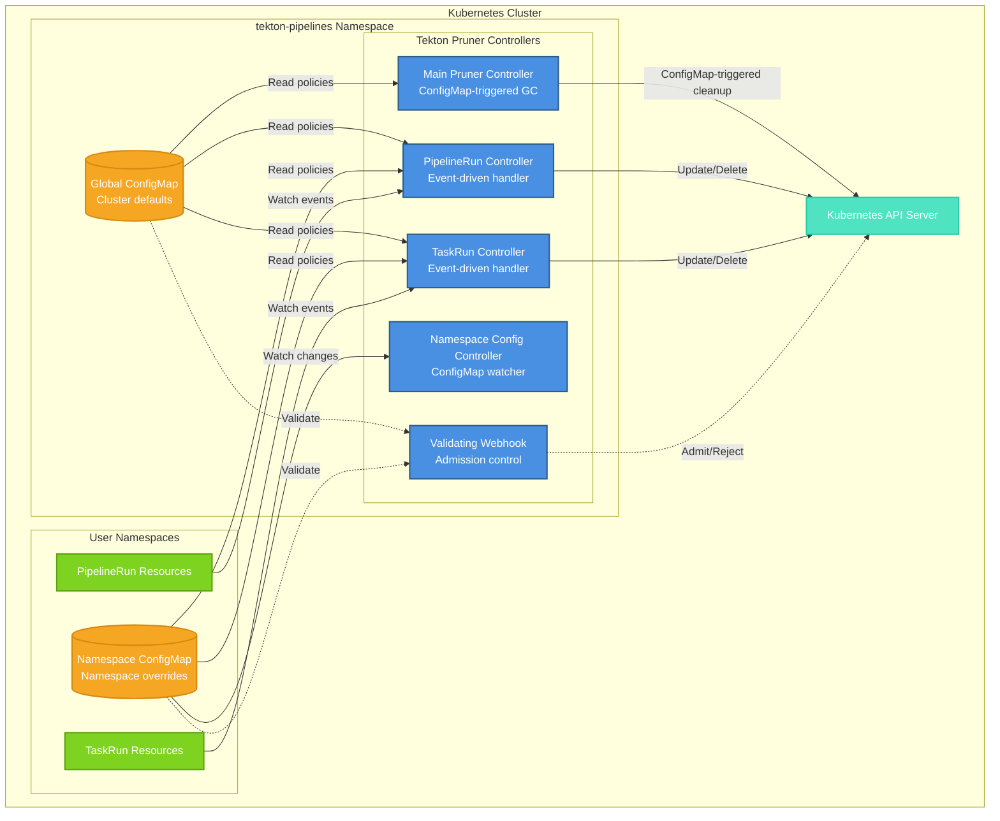
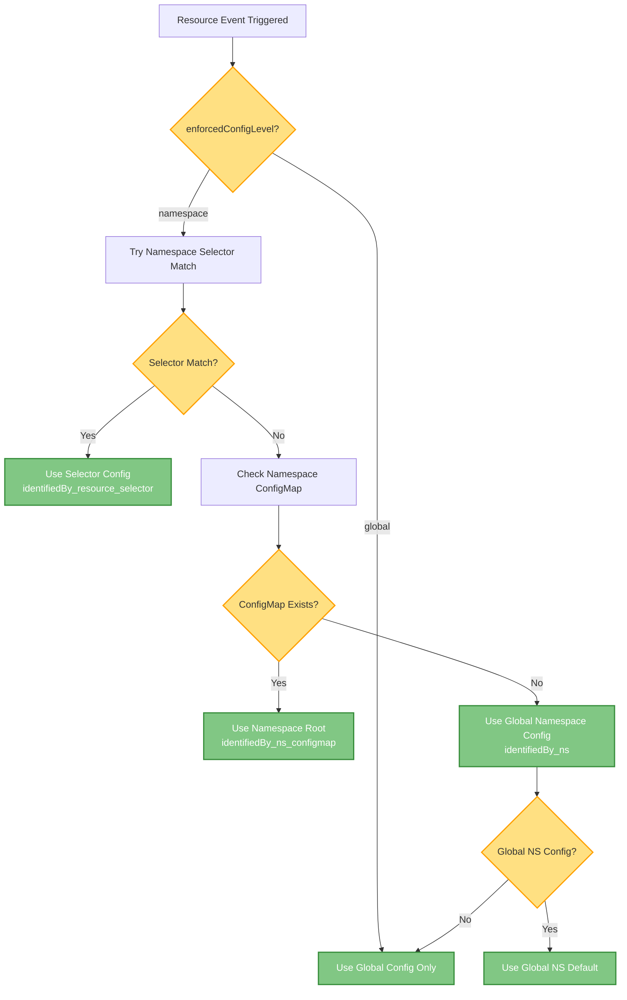
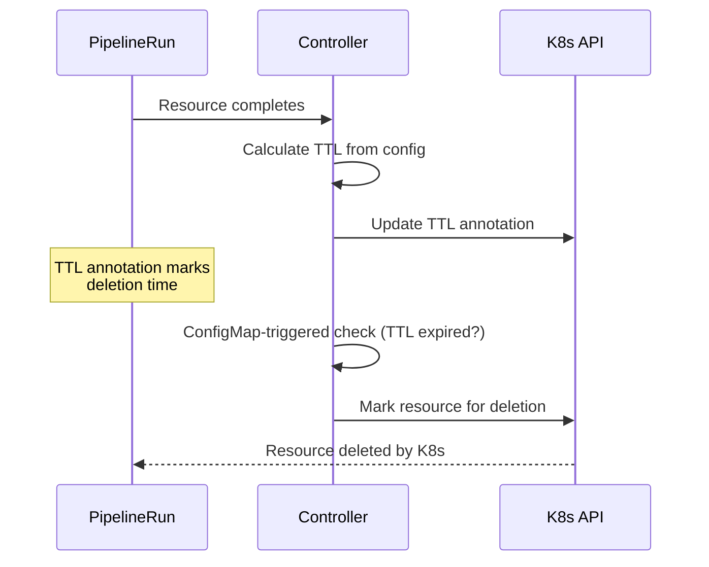
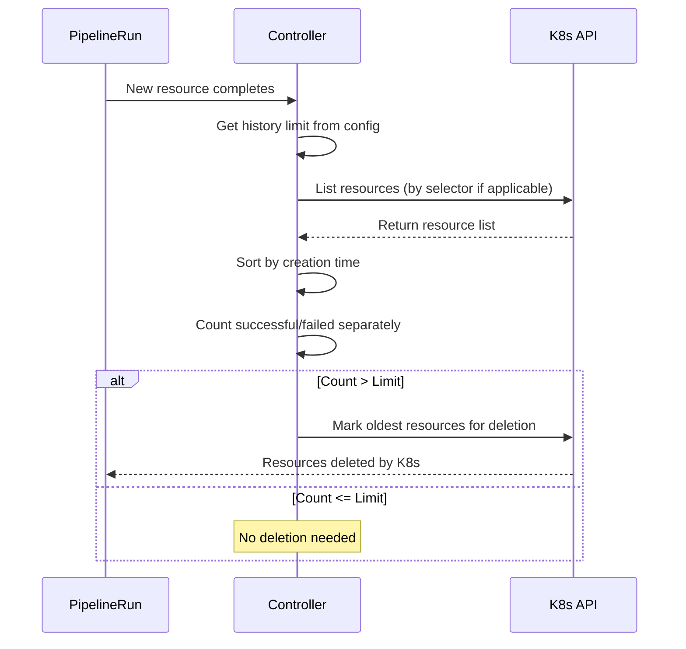
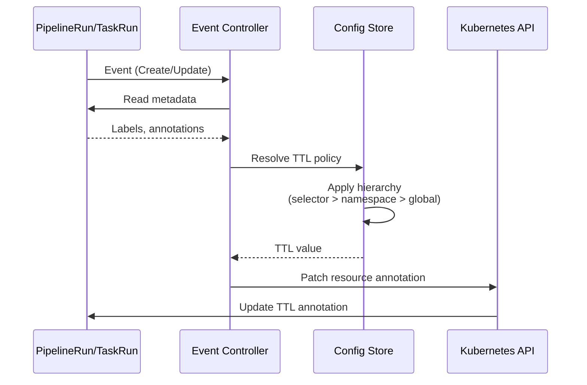
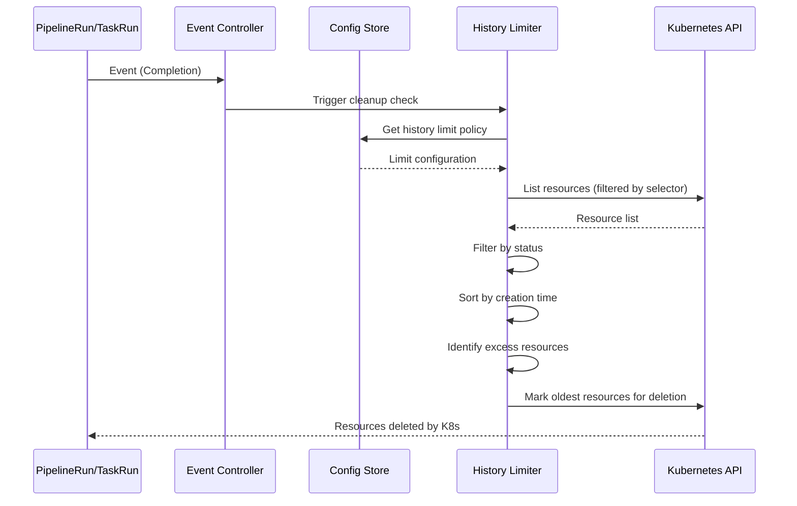

# Tekton Pruner Architecture

## Overview

Tekton Pruner is a Kubernetes controller system that automatically manages the lifecycle of Tekton PipelineRun and TaskRun resources. It follows the Kubernetes operator pattern, implementing event-driven and periodic reconciliation to enforce configurable time-based (TTL) and history-based pruning policies.

## Architecture Principles

### 1. Controller Pattern Implementation
- **Reconciliation Loops**: Multiple controllers watch and react to resource changes
- **Event-Driven Processing**: Controllers respond to Kubernetes events (ConfigMaps, PipelineRuns, TaskRuns)
- **ConfigMap-Driven Configuration**: Declarative policy specifications

### 2. Hierarchical Configuration Model
- **Three-Level Hierarchy**: Global → Namespace → Resource Selector
- **Precedence-Based Resolution**: More specific configurations override general defaults
- **Flexible Enforcement Modes**: Configurable granularity (global, namespace, resource)

### 3. Separation of Concerns
- **TTL Handler**: Time-based cleanup logic
- **History Limiter**: Count-based retention logic
- **Selector Matcher**: Resource identification and matching
- **Validation Webhook**: Admission-time configuration validation

### 4. Kubernetes-Native Design
- **Controller Runtime**: Leverages controller-runtime framework
- **Annotation-Based State**: TTL values stored in resource annotations
- **Minimal RBAC**: Only requires list, get, watch, delete, patch permissions
- **Namespace Isolation**: Per-namespace configuration independence

---

## C4 Architecture

### Level 1: System Context



### Level 2: Component View

```
┌────────────────────────────────────────────────────────┐
│                 Tekton Pruner Components               │
│                                                        │
│  Controllers:                                          │
│  ┌──────────────┐  ┌──────────────┐  ┌──────────────┐  │
│  │ Main Pruner  │  │ PipelineRun  │  │   TaskRun    │  │
│  │(ConfigMap GC)│  │(Event-driven)│  │(Event-driven)│  │
│  └──────────────┘  └──────────────┘  └──────────────┘  │
│                                                        │
│  ┌──────────────┐  ┌─────────────────────────────────┐ │
│  │ Namespace    │  │   Validating Webhook            │ │
│  │ ConfigWatch  │  │   (Admission Control)           │ │
│  └──────────────┘  └─────────────────────────────────┘ │
│                                                        │
│  Core Logic (Marks resources for deletion):            │
│  ┌──────────────┐  ┌──────────────┐  ┌──────────────┐  │
│  │ Config Store │  │  TTL Handler │  │   History    │  │
│  │ & Hierarchy  │  │              │  │   Limiter    │  │
│  └──────────────┘  └──────────────┘  └──────────────┘  │
└────────────────────────────────────────────────────────┘
```

**Key Components:**
- **Controllers**: Four reconcilers handling events and garbage collection
- **Core Logic**: Configuration resolution, TTL processing, history limiting
- **Validation**: Admission webhook for ConfigMap validation

---

## Component Interactions

### Controller Responsibilities

| Controller | Trigger | Purpose |
|------------|---------|---------|
| Main Pruner | ConfigMap changes | Runs full garbage collection across all namespaces for TTL-expired resources |
| PipelineRun | Kubernetes events | Updates TTL annotations, enforces history limits |
| TaskRun | Kubernetes events | Updates TTL annotations, enforces history limits |
| Namespace Config | ConfigMap watch | Reloads configuration when ConfigMaps change |
| Validating Webhook | Admission request | Validates ConfigMap syntax and rules |

### Core Logic Components

| Component | Responsibility |
|-----------|----------------|
| Config Store | In-memory cache of global and namespace configurations |
| Hierarchy Resolver | Determines which config applies (selector > namespace > global) |
| TTL Handler | Calculates expiration time and marks expired resources for deletion |
| History Limiter | Counts resources by status and marks oldest for deletion when limit exceeded |
| Selector Matcher | Matches resources to policies via labels/annotations |

---

## Configuration Model

### Hierarchy Levels

**Level 1: Global Configuration**
- Location: `tekton-pipelines` namespace
- ConfigMap: `tekton-pruner-default-spec`
- Scope: Cluster-wide defaults
- Selector Support: No

**Level 2: Namespace Configuration**
- Location: User namespaces
- ConfigMap: `tekton-pruner-namespace-spec`
- Scope: Namespace-specific overrides
- Selector Support: Yes

**Level 3: Resource Selector Configuration**
- Location: Within namespace ConfigMap
- Scope: Resource-level policies via label/annotation matching
- Matching Logic: AND within selector, OR across selectors

### Precedence Rules



**Hierarchy Summary:**
1. **Global Mode**: Uses only global config (no namespace overrides)
2. **Namespace Mode** (Recommended): 
   - Selector match → Namespace ConfigMap root → Global namespace config → Global root

### Enforcement Modes

| Mode | Description | Selector Support | Notes |
|------|-------------|------------------|-------|
| `global` | Only global config applies | No | Simplest mode, cluster-wide defaults |
| `namespace` | Namespace configs override global | Yes | **Recommended**: Enables namespace-level control with selectors |
| `resource` | Uses selectors from global config's namespace section | Yes | Internal mode, not typically set by users |

> **Note**: While `resource` mode exists in the code, users should use either `global` or `namespace` mode. The `resource` mode is primarily for backward compatibility and internal use.

---

## Core Workflows

### TTL-Based Pruning Flow

```
1. Resource completes (status.completionTime set)
2. Event controller receives event and updates TTL annotation
3. Configuration resolver determines applicable TTL:
   - Check selector match (if namespace enforcement)
   - Fallback to namespace default
   - Fallback to global default
4. TTL annotation stored on resource (marks deletion time)
5. When ConfigMap changes, Main Pruner Controller runs GC:
   - Scans all resources with TTL annotations
   - If (current time > completionTime + TTL): Controller marks resource for deletion
   - Kubernetes deletes the resource
   - Metrics recorded
```

**Flow Diagram:**



### History-Based Pruning Flow

```
1. Resource completes with status (Succeeded/Failed)
2. Controller lists all resources in scope:
   - If selector defined: Filter by selector labels/annotations
   - Otherwise: All resources in namespace
3. Count resources by status (separate counts for success/failed)
4. If count exceeds limit:
   - Sort by creation timestamp (oldest first)
   - Controller marks excess resources for deletion
   - Kubernetes deletes the resources
   - Metrics recorded
```

**Flow Diagram:**



### Selector Matching Logic

```
For each resource:
  For each selector config (OR):
    Match ALL labels in matchLabels (AND)
    AND
    Match ALL annotations in matchAnnotations (AND)
    
    If match found:
      Apply this config
      Break
  
  If no selector matches:
    Apply namespace default config
```

---

## Data Flow

### TTL Annotation Update Flow



### History Limit Cleanup Flow



---

## Design Decisions

### Why Event-Driven + ConfigMap-Triggered GC?
- **Event-Driven (PipelineRun/TaskRun)**: Immediate annotation updates and history limit enforcement
- **ConfigMap-Triggered GC**: Full cluster scan for TTL cleanup when configuration changes
- **Efficient Design**: Avoids constant polling, only cleans up when policies change

### Why Hierarchical Configuration?
- **Flexibility**: Single-tenant (global) or multi-tenant (namespace) support
- **Delegation**: Namespace owners control their own retention policies
- **Centralized Defaults**: Platform teams set reasonable fallbacks

### Why Separate TTL and History?
- **Independent Concerns**: Time-based vs count-based retention are different requirements
- **Combined Use**: Both can apply simultaneously (shortest retention wins)
- **Clear Semantics**: Each mechanism has distinct configuration and behavior

### Why Annotations for TTL State?
- **Auditability**: TTL value visible in resource metadata
- **Debugging**: Users can inspect computed TTL on resources
- **Idempotency**: Prevents recomputation on every reconcile

---

## Observability

### Metrics Exposed
- `pruner_resources_deleted_total`: Counter of deleted resources
- `pruner_cleanup_duration_seconds`: Histogram of cleanup operation duration
- `pruner_config_reloads_total`: Counter of configuration reloads

### Logging Strategy
- **INFO**: Normal operations (reconciliation, config updates, deletions)
- **DEBUG**: Detailed matching logic (selector evaluation, TTL calculations)
- **ERROR**: Failures (deletion errors, validation failures, API errors)

### Key Log Messages
- `"TTL configuration found"`: Which config level applied
- `"Loading namespace config"`: ConfigMap watcher activity
- `"identifiedBy: resource_selector"`: Selector matching confirmed

---

## Security & RBAC

### Required Permissions

**Cluster-Scoped:**
- `tekton.dev/pipelineruns`: `get`, `list`, `watch`, `delete`, `patch`
- `tekton.dev/taskruns`: `get`, `list`, `watch`, `delete`, `patch`
- `configmaps`: `get`, `list`, `watch` (in all namespaces)

**Namespace-Scoped:**
- None (all operations are cluster-scoped)

### Admission Webhook Validation

Prevents:
- Invalid YAML syntax in ConfigMaps
- Selector usage in global ConfigMaps (architectural constraint)
- Malformed selector expressions
- Conflicting policy definitions

---

## Extensibility Points

### Adding New Resource Types
1. Implement new reconciler in `pkg/reconciler/<resourcetype>/`
2. Register with controller-runtime manager
3. Reuse existing `ttl_handler` and `history_limiter` logic

### Custom Deletion Policies
- Extend `history_limiter.go` with new sorting strategies
- Current: Oldest-first (by creation timestamp)
- Potential: Last-used, priority-based, cost-aware

### Additional Configuration Sources
- Current: ConfigMaps only
- Potential: CRDs, external config servers, Git repositories

---

## Troubleshooting Guidelines

### Resource Not Deleted Despite Expired TTL
1. Verify TTL annotation exists: `kubectl get <resource> -o jsonpath='{.metadata.annotations}'`
2. Check controller logs for TTL calculation: `grep "TTL configuration found"`
3. Confirm main pruner controller is running: `kubectl get pods -n tekton-pipelines`

### Selector Not Matching Resources
1. Verify resource has expected labels/annotations
2. Check controller logs for `identifiedBy` value (should be `resource_selector`)
3. Validate selector syntax in ConfigMap (must be array format)

### Too Many/Few Resources Retained
1. Check history limits in active configuration
2. Verify selector is matching intended resources
3. Confirm enforcement level: `enforcedConfigLevel` in global ConfigMap

---

## References

- [Tekton Pipelines Documentation](https://tekton.dev/docs/)
- [Kubernetes Operator Pattern](https://kubernetes.io/docs/concepts/extend-kubernetes/operator/)
- [Controller Runtime](https://pkg.go.dev/sigs.k8s.io/controller-runtime)
- [C4 Model for Software Architecture](https://c4model.com/)

---

**Version:** 0.3.3  
**Last Updated:** December 1, 2025  
**Maintainers:** Tekton Pruner Contributors
