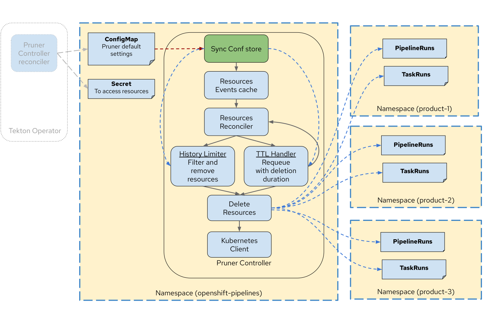

<!--

---
title: "Tekton resource pruning based on predefined configuration"
linkTitle: "Tekton Resource Pruning"
weight: 10
description: Configuration based event driven pruning solution for Tekton
cascade:
  github_project_repo: https://github.com/tektoncd/pruner
---
-->

# Tekton Pruner

[](https://github.com/tektoncd/pruner/blob/main/LICENSE)

Tekton Pruner is a Kubernetes controller that automatically manages the lifecycle of Tekton resources by cleaning up completed PipelineRuns and TaskRuns based on configurable policies.

## Overview

Tekton Pruner provides event-driven and configuration-based cleanup of Tekton resources. It consists of four controllers:
- Main Pruner controller that periodically processes cleanup based on ConfigMap settings
- Namespace Pruner Config controller that watches namespace-level ConfigMaps across all namespaces
- PipelineRun controller that handles PipelineRun events
- TaskRun controller that handles standalone TaskRun events

<p align="center">
</img>
</p>

## Features

### 1. Time-based Pruning (TTL)
- Automatically delete completed PipelineRuns and TaskRuns after a specified time period
- Configure using `ttlSecondsAfterFinished` setting

### 2. History-based Pruning
- Maintain a fixed number of PipelineRuns/TaskRuns based on their status
- Configure using:
  - `successfulHistoryLimit`: Number of successful runs to retain
  - `failedHistoryLimit`: Number of failed runs to retain
  - `historyLimit`: When `successfulHistoryLimit` and `failedHistoryLimit` are not set, this value will be used as the limit for both successful and failed runs individually

### 3. Flexible Configuration Hierarchy
Configurations can be applied at different levels (from highest to lowest priority):
1. Resource Level: Specific to individual PipelineRuns/TaskRuns. (Coming in next release)
2. Resource Group level: PipelineRuns and TaskRuns can be grouped based on pipeline/task names, labels, or annotations. (Coming in next release)
3. Namespace Level: Applied to all resources in a namespace (Tech Preview)
4. Global Level: Cluster-wide defaults (Tech Preview)

> **Note**: Currently, only Namespace and Global level configurations are available as Tech Preview features. Resource Level and Resource Group level configurations will be available in the next version for review.

### Resource Groups Configuration

PipelineRuns and TaskRuns can be grouped based on pipeline names, labels, or annotations. Each group can have its own pruning policy:

```yaml
data:
  global-config: |
    namespaces:
      my-namespace:
        pipelineRuns:
          # Group by pipeline name
          - selector:
              matchLabels:
                tekton.dev/pipeline: build-pipeline
            ttlSecondsAfterFinished: 600    # 10 minutes
            successfulHistoryLimit: 5

          # Group by environment label
          - selector:
              matchLabels:
                environment: production
            ttlSecondsAfterFinished: 1200   # 20 minutes
            failedHistoryLimit: 10

          # Group by application type annotation
          - selector:
              matchAnnotations:
                app.tekton.dev/type: release
            ttlSecondsAfterFinished: 3600   # 1 hour
            historyLimit: 20
```

The pruner evaluates each group's selector against the PipelineRun/TaskRun metadata. If a resource matches multiple groups, the first matching group's policy is applied. Resources that don't match any group use the namespace or global default policy.

Common grouping strategies:
- By pipeline name using `tekton.dev/pipeline` label
- By environment (dev/staging/prod)
- By application or component
- By release type or importance
- By team or department

## Installation

Prerequisites:
- Kubernetes cluster
- [Tekton Pipelines](https://github.com/tektoncd/pipeline/blob/main/docs/install.md) installed on your cluster before you install Pruner.


- Install Pruner
```bash
export VERSION=0.1.0 #update version as required
kubectl apply -f "https://github.com/tektoncd/pruner/releases/download/v$VERSION/release-v$VERSION.yaml"
```

Verify installation:
```bash
kubectl get pods -n tekton-pipelines
```

Look for the `tekton-pruner-controller` pod running.

## Configuration

The pruner is configured through a ConfigMap in the `tekton-pipelines` namespace. By default config includes minimal configuration as per spec [here](https://raw.githubusercontent.com/tektoncd/pruner/refs/heads/main/config/600-tekton-pruner-default-spec.yaml). This can be modified as required. Here's a basic example:

```yaml
apiVersion: v1
kind: ConfigMap
metadata:
  name: tekton-pruner-default-spec
  namespace: tekton-pipelines
data:
  global-config: |
    enforcedConfigLevel: global
    ttlSecondsAfterFinished: 300    # 5 minutes
    successfulHistoryLimit: 3       # Keep last 3 successful runs
    failedHistoryLimit: 3           # Keep last 3 failed runs
    historyLimit: 5                 # When successfulHistoryLimit and failedHistoryLimit are not set
```

### Namespace-specific Configuration

#### Method 1: Global ConfigMap with Namespace Specs

Override global settings for specific namespaces in the global ConfigMap:

```yaml
data:
  global-config: |
    enforcedConfigLevel: namespace
    ttlSecondsAfterFinished: 300
    namespaces:
      my-namespace:
        ttlSecondsAfterFinished: 60  # Override for specific namespace
```

#### Method 2: Namespace-Level ConfigMap (for User Namespaces)

> **Important**: Only create this ConfigMap in user namespaces, **not** in system or Tekton controller namespaces (e.g., `tekton-pipelines`, `kube-*`, `openshift-*`).

**Step 1:** Set enforced config level to `namespace`:
```yaml
apiVersion: v1
kind: ConfigMap
metadata:
  name: tekton-pruner-default-spec
  namespace: tekton-pipelines
data:
  global-config: |
    enforcedConfigLevel: namespace
```

**Step 2:** Create namespace-level ConfigMap in your user namespace:
```yaml
apiVersion: v1
kind: ConfigMap
metadata:
  name: tekton-pruner-namespace-spec  # Fixed name
  namespace: my-app-namespace          # Your user namespace (NOT system namespaces!)
data:
  ns-config: |
    historyLimit: 100
    successfulHistoryLimit: 50
    failedHistoryLimit: 100
    ttlSecondsAfterFinished: 300
```

Apply it:
```bash
kubectl apply -f namespace-config.yaml -n my-app-namespace
```

The namespace-level ConfigMap takes priority when `enforcedConfigLevel: namespace` is set in the global config. See [Namespace Configuration Tutorial](docs/tutorials/namespace-configuration.md) for more details.

## Contributing

- See [DEVELOPMENT.md](DEVELOPMENT.md) for development setup
- Submit issues and pull requests
- Follow coding standards and test coverage requirements

## License

Apache License 2.0 - See [LICENSE](LICENSE) for details